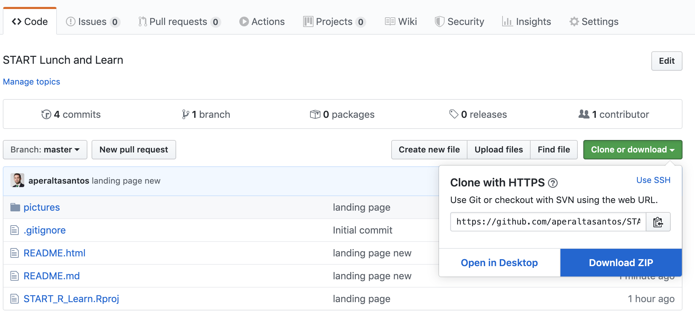

# START R Learn&Learn

### Learning objectives 
- Learn how to set an R project
- Learn the basics of R markdown
- Reproducibility basics 
- Data Wrangling with tidyverse
- Create tables with Kable
- Basics of writing a paper in R 

### Pre-requisites 
- Install R Studio
- Download zip repository 

### Resources
- How to set an R project [here](https://swcarpentry.github.io/r-novice-gapminder/02-project-intro/) 
- Markdown basics [here](https://bookdown.org/yihui/rmarkdown/basics.html) 

### Usefull packages 
- [Remedy](https://github.com/ThinkR-open/remedy) 
Very nice to help with Markdown formating 
remotes::install_github("ThinkR-open/remedy")
- [Tidyverse](https://www.tidyverse.org/packages/) 
The swiss knife of R packages, and includes dplyr, ggplot, Lubridate, and many other
- [Broom](https://cran.r-project.org/web/packages/broom/vignettes/broom.html) 
Transforms model outputs into tidy dataframes
- [Kable](https://cran.r-project.org/web/packages/kableExtra/vignettes/awesome_table_in_html.html)
Creates nice tables that easy to format 

