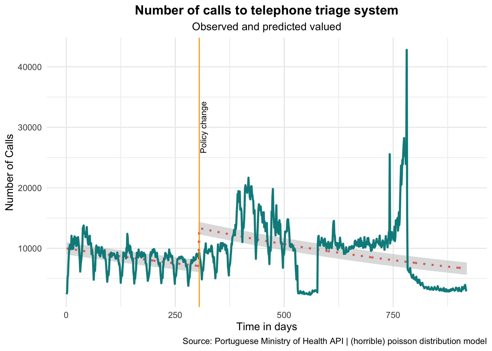

\pagebreak
Abstract
===============================================================================


#### Background  
A telephone triage system is a known policy option to improve the appropriateness, timeliness, quality of care of emergency care while improving patient outcomes.

#### Methods
We did an interrupted time-series analysis 

#### Results
The is something going on

#### Conclusion 
We have a horrible model, dont trust in the results 

\pagebreak
Introduction
================================================================================

The high-income countries are experiencing a growing demand for emergency care, which can adversely affect the provider workload and quality of care. A telephone triage system is a known policy option to improve the appropriateness, timeliness, quality of care of emergency care while improving patient outcomes [@berchet2015emergency] [@world2008emergency].  

Telephone triage systems are usually inquired by a nurse-led team that will provide algorithmically-oriented advice, coaching, or A&E service forwarding. This kind of service was championed by the British National Health Service (NHS) direct landline, which started operating in 1998 and was expanded to a website with a symptom checker one year later. This system evolved and became the NHS 111  in 2014. This new system centralized all the different regional numbers around Great Britain previously associated with NHS Direct and transitioned the triage work from nurses to telephone advisors. Other countries implemented triage systems: United
Kingdom, France, Belgium [@jonckheer2011after], Australia [@turner2002telephone] and Denmark [@olejaz2012denmark]. Nevertheless, the evidence of the effectiveness of the telephone triage to decrease inappropriate ER visits is scarce and contradictory [@turner2015evidence] [@pope2017has] [@turner2013impact].

\pagebreak
Methods
================================================================================


\pagebreak
Results
================================================================================

```{r setup, include=FALSE}
knitr::opts_chunk$set(
  collapse = TRUE,
  warning = FALSE,
  message = FALSE,
  echo = FALSE,
  eval = TRUE
  )
library(kableExtra)
library(tidyverse)
library(here)
```

```{r}
# remotes::install_github("ropenscilabs/reviewer")
# https://ropenscilabs.github.io/reviewer/articles/reviewer.html
# Package to review papers in R
```

```{r echo=FALSE,  message=FALSE, warning=FALSE}
load(here::here("analysis", "table_desc1.csv"))

kable(sns4, 
      caption = "Decriptive statistics of the number of calls", 
      booktabs = T, 
      digits = 3,
      col.names = c("Month Name",
                    "Mean Calls",
                    "SD Calls",
                    "Max Calls", 
                    "Min Calls"))  %>%
  kable_styling(bootstrap_options = c("striped", "hover", "full_width" = F)) %>%
  footnote(general = "Negative Binomial model") %>%
kable_styling(latex_options = "hold_position")   
```

```{r echo=FALSE,  message=FALSE, warning=FALSE}
load(here::here("analysis", "table_m1.RData"))

kable(table_m1, 
      caption = "Effect of policy change expansion on the daily number of calls", 
      booktabs = T, 
      digits = 3,
      col.names = c("Variable",
                    "Estimate",
                    "Low 95% CI",
                    "High 95% CI", 
                    "p Value"))  %>%
  kable_styling(bootstrap_options = c("striped", "hover", "full_width" = F)) %>%
  footnote(general = "Negative Binomial model") %>%
kable_styling(latex_options = "hold_position")   
```



\pagebreak
Discussion
================================================================================

This study evaluates the impact on demand and quality of service of a policy change of the telephone triage system.

\pagebreak
References
===============================================================================

